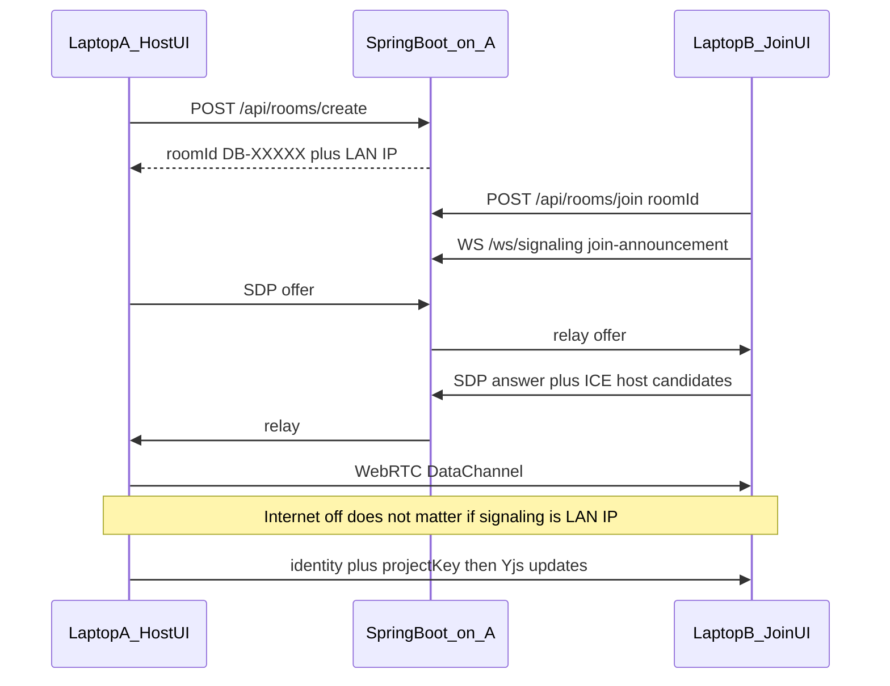
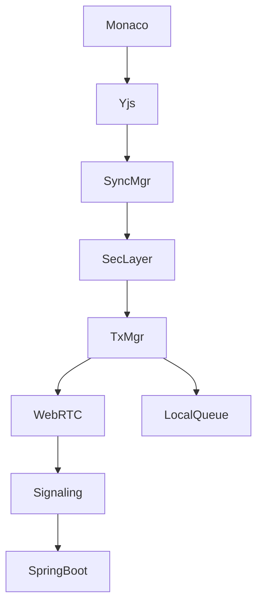

# Jury-ready P2P architecture for DecentraIDE

## What the jury path requires

You will run **two physical laptops on the same Wi-Fi**, **no public internet**, host creates a **room ID**, joiner enters that ID, **Spring Boot signaling on the host**, then a **WebRTC DataChannel**, then **Yjs live sync**. After that you show conflict management, code sync, LAN/Wi-Fi continuity (internet switched off), and hacker safety.

That is compatible with the existing design in [docs/architecture.md](docs/architecture.md): the Spring Boot process is **only** identity, rooms, and SDP/ICE relay. Source and CRDT state stay on the peers.

## What exists today vs what will fail on two laptops

The stack is already the right shape: React UI, `CollaborationManager`, Yjs, `TransportManager`, `WebRtcTransport`, `SecurityPipeline`, Spring Boot rooms + signaling.

These are the **actual blockers** for a live two-laptop demo:

1. **Laptop B cannot see Laptop A’s room.** Create/join uses relative `fetch('/api/rooms/...')` in [frontend/src/components/LeftSidebar.tsx](frontend/src/components/LeftSidebar.tsx). Vite proxies `/api` and `/ws` to **localhost:8082** only ([frontend/vite.config.ts](frontend/vite.config.ts)). B’s browser talks to **B’s** loopback, not A. [RoomController](backend/src/main/java/org/decentraide/server/room/RoomController.java) is in-memory on whichever JVM created the room.

2. **WebRTC signaling URL is the page host, not the room host.** [WebRtcTransport.ts](frontend/src/core/transport/WebRtcTransport.ts) uses `window.location.host` or `localhost:8082`. If B opens `http://localhost:5173`, signaling never reaches A.

3. **Google STUN is used** (`stun.l.google.com`). With internet off, STUN fails. Host ICE candidates can still work **on the same subnet**, but only if signaling already works and ICE is not stuck waiting on STUN. Plan: **empty `iceServers` for jury LAN** so ICE is host-candidates only.

4. **“LAN transport” is BroadcastChannel**, which is same-browser-origin, same OS profile — **not two laptops**. You asked not to use it for the demo. [LanTransport.ts](frontend/src/core/transport/LanTransport.ts) must stop being the cross-machine path.

5. **Browsers cannot listen for inbound TCP.** A real “LAN socket server inside Chrome” is impossible. On Wi-Fi with internet off, **WebRTC DataChannel using host ICE + LAN signaling IS the LAN P2P transport**. A second native TCP path is only viable in Electron main.

6. **Each peer generates its own AES project key** in [CollaborationManager.ts](frontend/src/core/sync/CollaborationManager.ts). Remote frames will not decrypt. Membership auto-adds the remote peer using **local** `publicKeyPem`. Sync will look “connected” and still not converge.

7. **Browser crypto is a stub.** [SecurityManager.ts](frontend/src/core/security/SecurityManager.ts) `verifySignature` accepts any `web-sig-*`. Fine for unit tests, not for a forged-op demo.

8. **Web Bluetooth cannot do laptop-to-laptop.** [WebBluetoothTransport.ts](frontend/src/core/transport/WebBluetoothTransport.ts) is GATT central-to-peripheral. Do not claim BT mesh in the jury script. Keep the transport interface, show **Nearby: WebRTC/LAN**, Bluetooth as **unsupported for peer sockets**.

9. **Conflict/safety code exists but is not wired as a two-laptop story.** CRDT tests in [ConflictManagement.test.ts](frontend/src/core/crdt/ConflictManagement.test.ts) pass in-process. Semantic resolver needs Ollama. Rule-based [CodeSafetyAnalyzer](frontend/src/core/security/CodeSafetyAnalyzer.ts) can demo without internet.

## Target architecture (keep CRDT ignorant of the wire)

Layers (do not collapse them):

- **Editor:** Monaco + `CrdtMonacoBinding` (`monaco-local` origin, no echo).
- **CRDT:** `YjsCrdtEngine` — source of truth; same `Y.Doc` per room.
- **Sync:** state-vector / `encodeStateAsUpdate` on peer `connected`; op log + snapshot while disconnected.
- **Security:** schema, replay, membership (real pubkeys), sign, encrypt with **one room key**.
- **Transport:** WebRTC DataChannel only for CRDT bytes in the jury path. Signaling is HTTP+WS to host:8082 on LAN.

## 1) Two-laptop room join (must work first)

**Recommended jury topology (simplest, most reliable):**

- Laptop A runs **Spring Boot on `0.0.0.0:8082`** and Vite with `server.host: true` / `0.0.0.0`.
- UI on A shows **LAN IPv4 + room ID** (e.g. `192.168.1.14` + `DB-72A91`).
- Laptop B opens `http://192.168.1.14:5173` (same app origin, same signaling proxy) **or** runs UI locally but with an explicit **Signaling host** field pointing at A.

Do **not** run two independent backends. Room state is in-memory in one JVM.

Changes:

- [application.properties](backend/src/main/resources/application.properties): bind `0.0.0.0`.
- Add `GET /api/runtime/lan-info` returning host addresses (and keep CORS as-is).
- Vite: `host: true`; optional proxy target from `VITE_SIGNALING_URL`.
- [WebRtcTransport](frontend/src/core/transport/WebRtcTransport.ts): `wsUrl` from `SignalingConfig` (host IP + port), not page host unless they match.
- Join UI: Room ID + optional signaling host; join must fail visibly if room is unknown (today join still calls `startSession` even when REST fails).
- Signaling handler: **route by `roomId` + `target`**, not “broadcast to every WebSocket”. Current [WebSocketConfig](backend/src/main/java/org/decentraide/server/signaling/WebSocketConfig.java) leaks offers across rooms.

ICE for no-internet:

- `iceServers: []`
- `iceCandidatePoolSize: 0`
- Keep trickle ICE
- Treat `iceConnectionState === 'failed'` as transport offline and show **ICE failed (check AP client isolation)** — some campus Wi-Fi blocks peer-to-peer; fallback below.

## 2) Code synchronisation (the main demo)

After DataChannel `open`:

1. Exchange **hello**: `peerId`, `publicKeyPem`, roomId, protocol version.
2. Host sends **`key.distribute`**: AES-256-GCM room key (signaling is LAN-only; after this, CRDT never goes in plaintext).
3. Both add each other to membership with the **remote** public key (stop using local key).
4. Yjs **sync step**: `encodeStateAsUpdate` / state vector so late joiners get full doc, not only future keystrokes.
5. Ongoing: local Monaco → Y.Text → `onUpdate` → encrypt/sign → `broadcast` on DataChannel → remote pipeline → `applyUpdate(..., remote-peer)` → Monaco (skip `monaco-local`).

Fix [CollaborationManager](frontend/src/core/sync/CollaborationManager.ts):

- One `Y.Doc` per `roomId` (reset or isolate when switching rooms).
- Do not apply raw unsigned binary as a silent fallback in the jury build (that bypasses safety).
- Persist snapshot keyed by roomId.
- Status bar: `signaling` → `webrtc connecting` → `verified` via existing [ConvergenceVerifier](frontend/src/core/sync/ConvergenceVerifier.ts) hash compare after first sync.

Replace stub Web Crypto with **Web Crypto SubtleCrypto** (Ed25519 if available, else ECDSA P-256) so browser-to-browser signatures are real. Keep Node path for tests.

## 3) Conflict management (two layers, one jury script)

**Layer A — CRDT (must work with internet off, no AI):** concurrent typing on the same file. Yjs YATA merges; hashes match. This is the live “both laptops typing” proof.

**Layer B — semantic (optional if Ollama is not on both machines):** overlapping same-method edits → [SemanticConflictResolver](frontend/src/core/merge/SemanticConflictResolver.ts) + [ConflictResolutionView](frontend/src/components/ConflictResolutionView.tsx). If Ollama is down, **static AST/heuristic conflict card** still shows versions A/B and “Accept A / Accept B / Manual”; never block Layer A.

Wire a simple overlap detector (same path, two authors, same line window from CRDT awareness or last-edit metadata) into the bottom panel so the jury sees a conflict, not only identical merged text.

## 4) LAN / Wi-Fi when internet is off (not BroadcastChannel)

**Primary:** LAN signaling + WebRTC host ICE. Turning off internet **after** the DataChannel is up should change nothing (signaling already unused for CRDT). Turning it off **before** join still works if B uses A’s LAN IP.

**Failover if ICE fails (Wi-Fi client isolation):** add a **room-scoped binary relay** on Spring Boot (`/ws/lan-relay/{roomId}`) that forwards encrypted frames only, no persistence, no decrypt. Label it honestly in the UI as `LAN relay (host laptop)` so you do not pretend it is a DataChannel. This is the only browser-legal backup without Electron sockets.

**Do not** implement UDP multicast inside the renderer. If you later package Electron, native TCP can replace the relay; CRDT must not care.

Remove BroadcastChannel from the production LAN path. Keep it only behind a test flag if tests need it.

## 5) Bluetooth

Keep `Transport` id `bluetooth` and `WebBluetoothTransport` as **capability probe + explicit unsupported for P2P**.

Jury line: “Bluetooth GATT cannot open a laptop-to-laptop socket in Chrome; nearby path is Wi-Fi WebRTC.” Do not auto-mark Bluetooth peers `connected`. Optional later: Electron native RFCOMM — out of jury scope unless you switch to Electron.

## 6) Hacker safety (both A and C, demoable offline)

**Peer attacks (must work on the DataChannel):** keep the 5-stage pipeline in [SecurityPipeline.ts](frontend/src/core/security/SecurityPipeline.ts). Fix the event that logs success as `'Invalid signature'`. Stop auto-trusting unknown peers with the local key.

Demo controls (real injection into `processIncomingFrame`, not fake UI text):

- invalid signature
- modified ciphertext
- duplicate `opId`
- unknown `from` / observer write

Show rejects in [SecurityMonitorView](frontend/src/components/SecurityMonitorView.tsx).

**Insecure code (no internet):** [SecurityRuleEngine](frontend/src/core/security/SecurityRuleEngine.ts) on the open buffer (secrets, `Runtime.exec`, SQL concat). User accepts fix → Yjs transaction origin `security-fix-applied` → syncs to the other laptop. Ollama is enhancement only.

Membership for the open-room jury: **anyone with the room ID is a Developer** after join REST; forged ops without that peer’s key still fail.

## Jury script (order of operations)

1. Both laptops on same Wi-Fi. **Disable mobile data / WAN** (or disable WAN after step 4 — both should work with LAN IP).
2. A: start backend + frontend. Create room. Show room ID + `http://<lan-ip>:5173`.
3. B: open that URL (or local UI + signaling host). Join room ID. Peer list updates on both.
4. Status: WebRTC connected. Type on A, appear on B (sync).
5. Both type in the same file (conflict/CRDT). Hashes verified.
6. Optional: overlap conflict panel.
7. Inject forged op → Security Monitor reject. Paste unsafe Java → rule engine → accept fix → other laptop updates.
8. Kill WAN if not already off; keep typing. Optionally stop signaling: **already-connected channel stays up**.

## Implementation order (avoid building features on a broken wire)

1. LAN bind, signaling host config, room-scoped WS, join error handling, two-laptop connect.
2. Host ICE-only WebRTC; prove DataChannel with a ping frame.
3. Shared room key + pubkey membership + Yjs sync + Monaco.
4. Convergence hash + peer list/status.
5. Security pipeline + injection demo.
6. Rule-engine safety apply-via-CRDT.
7. Semantic conflict UI with Ollama optional.
8. Strip BroadcastChannel; Bluetooth honest status; LAN-relay fallback only if ICE fails on your Wi-Fi.

## Files that will change most

- [frontend/src/core/transport/WebRtcTransport.ts](frontend/src/core/transport/WebRtcTransport.ts)
- [frontend/src/core/transport/LanTransport.ts](frontend/src/core/transport/LanTransport.ts) / [TransportManager.ts](frontend/src/core/transport/TransportManager.ts)
- [frontend/src/core/sync/CollaborationManager.ts](frontend/src/core/sync/CollaborationManager.ts)
- [frontend/src/core/security/SecurityManager.ts](frontend/src/core/security/SecurityManager.ts), [SecurityPipeline.ts](frontend/src/core/security/SecurityPipeline.ts)
- [frontend/src/components/LeftSidebar.tsx](frontend/src/components/LeftSidebar.tsx) (and duplicate join UI in NetworkAndSyncView)
- [backend/.../WebSocketConfig.java](backend/src/main/java/org/decentraide/server/signaling/WebSocketConfig.java), [RoomController.java](backend/src/main/java/org/decentraide/server/room/RoomController.java), [application.properties](backend/src/main/resources/application.properties)
- [frontend/vite.config.ts](frontend/vite.config.ts)

## Risks to treat as demo-blockers

- **Wi-Fi client isolation:** ICE host candidates never connect → need LAN relay on host.
- **Windows firewall** blocking 8082 / UDP ICE on A.
- **Two backends** accidentally running on B.
- **Ollama missing:** do not make semantic merge the only conflict story.
